# VORTREXYN Hangman

A cross-platform mobile word-guessing game built with **React Native + Expo**. Guess the hidden word letter by letter before the hangman is complete — with 4 difficulty levels, category hints, and a live global leaderboard.

Available on **iOS**.

---

## Screenshots

<table>
  <tr>
    <td align="center">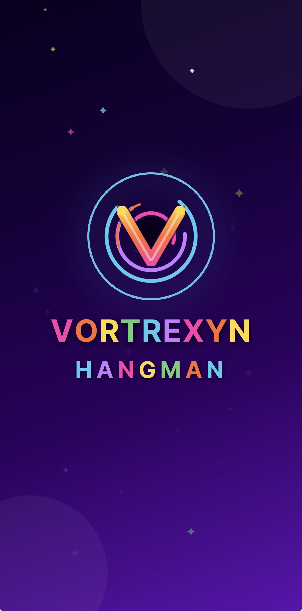<br/><sub>Splash Screen</sub></td>
    <td align="center">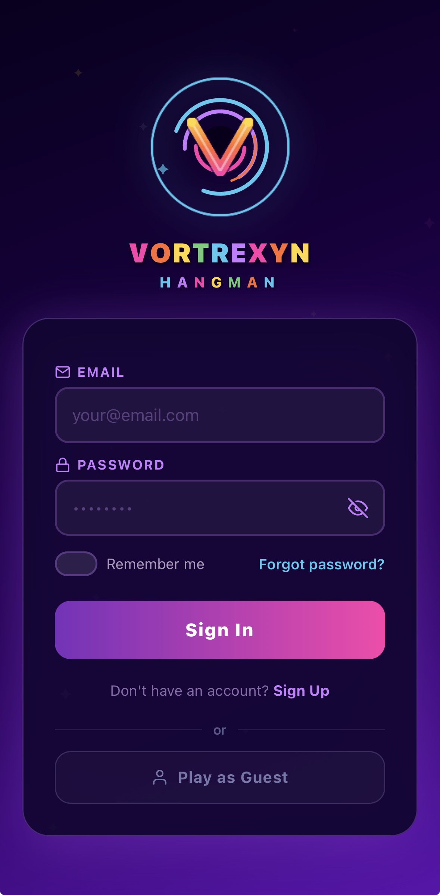<br/><sub>Sign In</sub></td>
    <td align="center">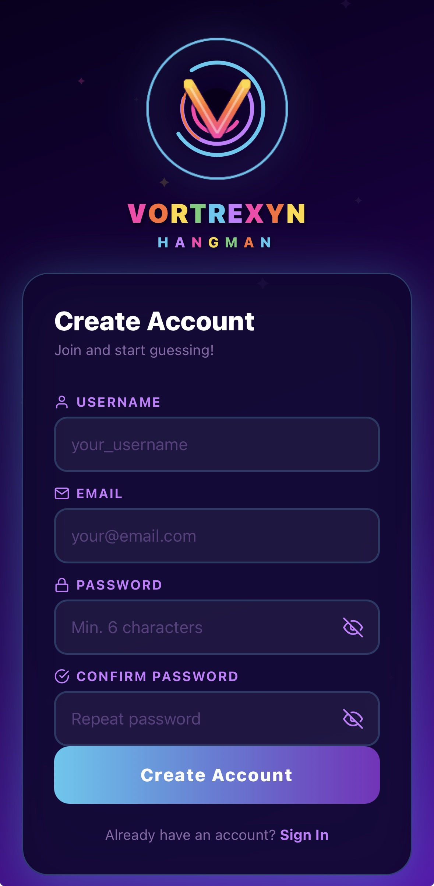<br/><sub>Sign Up</sub></td>
    <td align="center">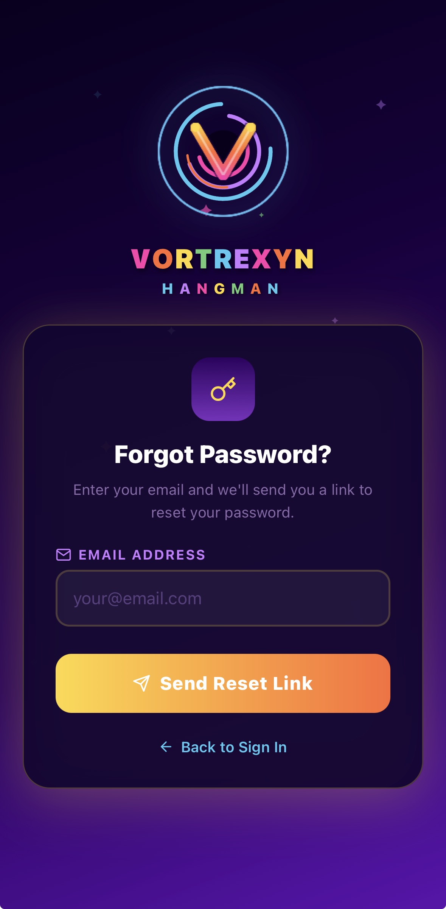<br/><sub>Forgot Password</sub></td>
  </tr>
  <tr>
    <td align="center">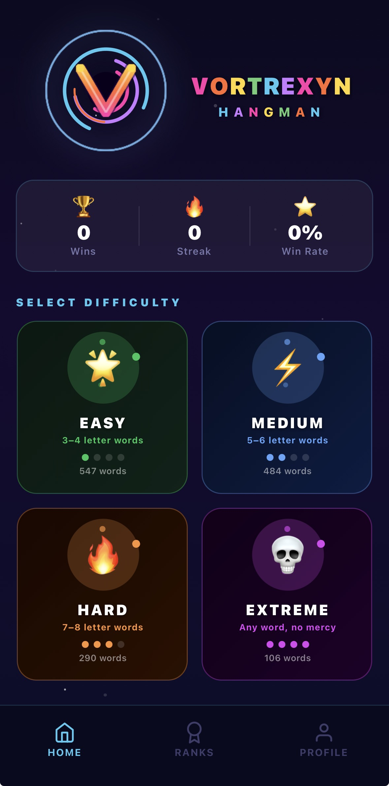<br/><sub>Home — Select Difficulty</sub></td>
    <td align="center">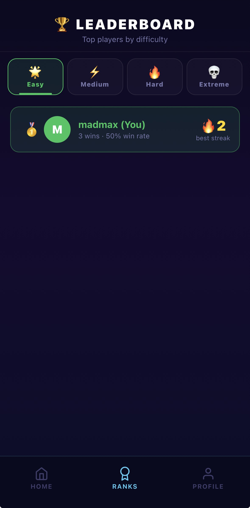<br/><sub>Leaderboard</sub></td>
    <td align="center">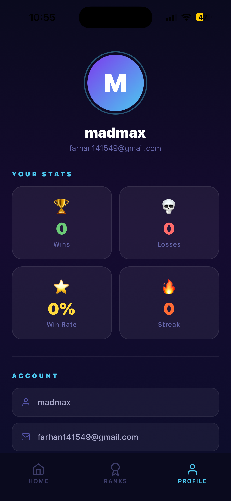<br/><sub>Profile & Stats</sub></td>
    <td align="center">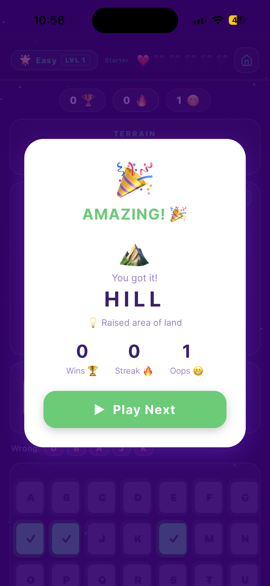<br/><sub>Win Modal</sub></td>
  </tr>
  <tr>
    <td align="center">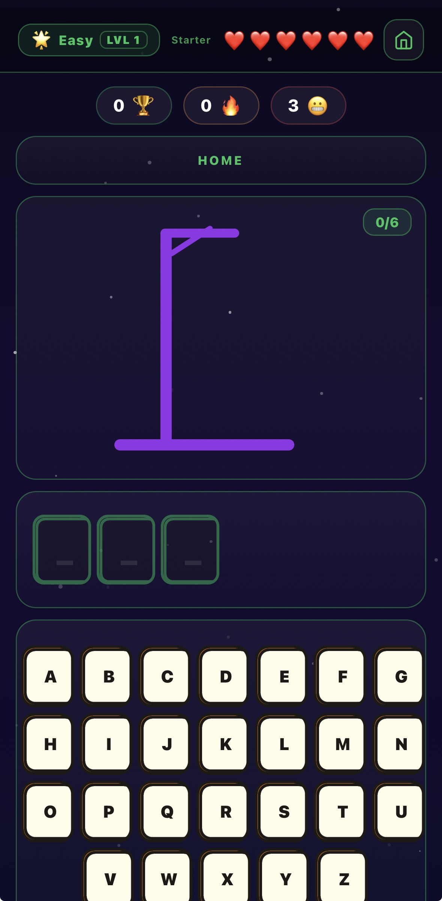<br/><sub>Easy Mode</sub></td>
    <td align="center">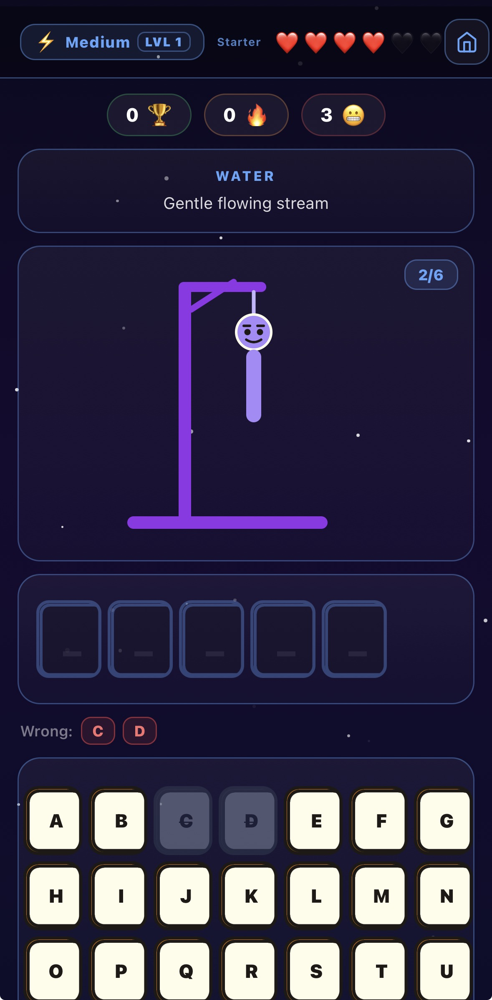<br/><sub>Medium Mode</sub></td>
    <td align="center">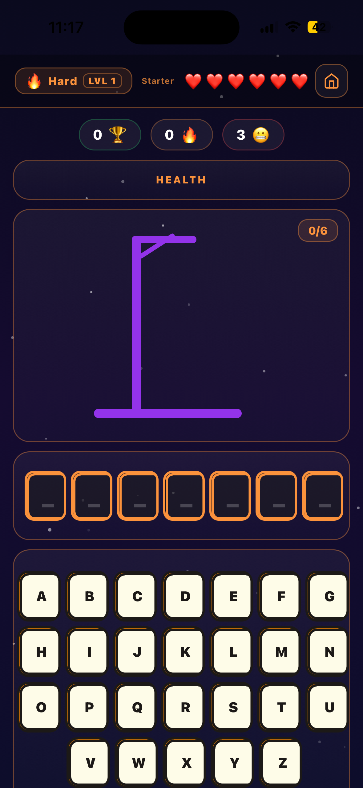<br/><sub>Hard Mode</sub></td>
    <td align="center">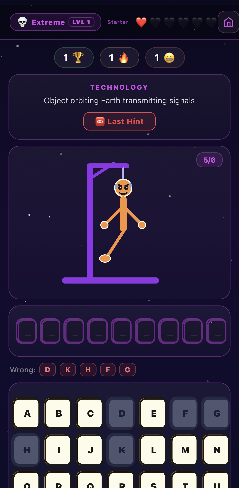<br/><sub>Extreme Mode</sub></td>
  </tr>
  <tr>
    <td align="center">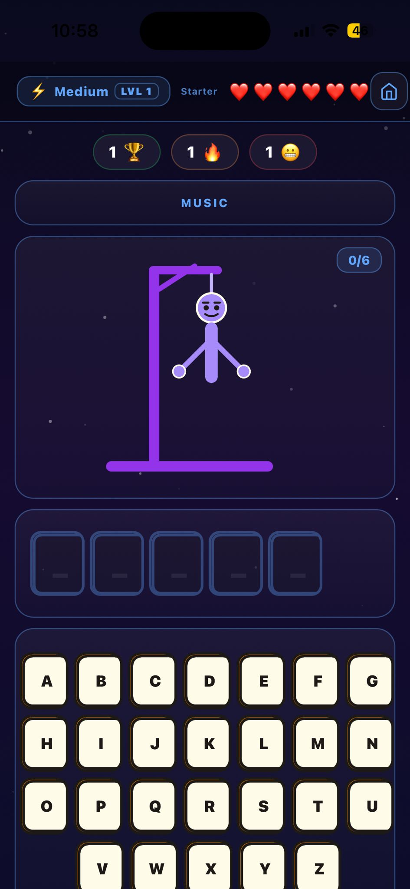<br/><sub>Hangman Figure</sub></td>
    <td align="center">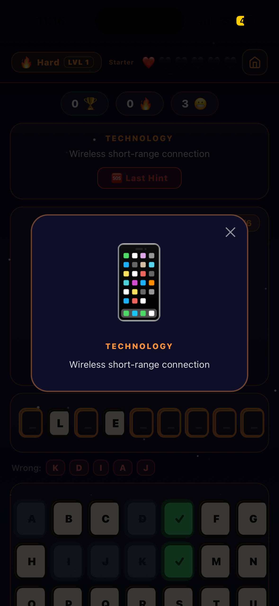<br/><sub>SOS Hint</sub></td>
    <td align="center">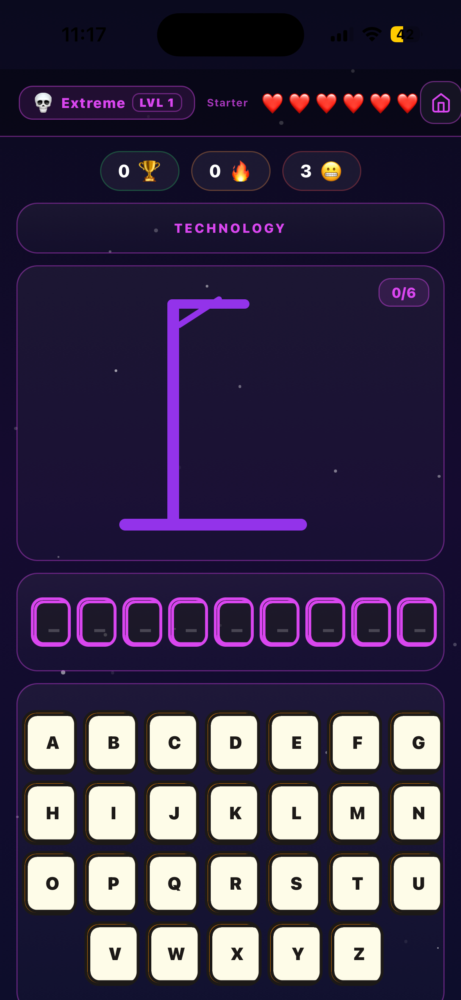<br/><sub>Extreme Start</sub></td>
    <td></td>
  </tr>
</table>

---

## Features

- **Animated splash screen** with the VORTREXYN logo on every launch
- **Firebase Auth** — email/password sign-in, sign-up, password reset, and guest play
- **4 difficulty modes**
  - **Easy** — 3–4 letter words (547 words)
  - **Medium** — 5–6 letter words (484 words)
  - **Hard** — 7–8 letter words (290 words)
  - **Extreme** — any word, no mercy (106 words)
- **Category hints** — every word has a category label (e.g. Technology, Health, Colors)
- **SOS Last Hint** — one-time descriptive hint per round when you're stuck
- **Animated hangman figure** — body parts appear progressively with each wrong guess (6 chances)
- **Global Firestore leaderboard** — scores tracked per difficulty with wins, win rate, and best streak
- **Player profile** — wins, losses, win rate, and streak stats per account
- **Dark space-themed visuals** — deep purple palette with neon accents throughout

---

## Tech Stack

| Layer | Technology |
|---|---|
| Framework | React Native + Expo (SDK 54) |
| Navigation | Expo Router (file-based) |
| Auth | Firebase Authentication |
| Database | Cloud Firestore |
| Styling | React Native StyleSheet + expo-linear-gradient |
| Animations | React Native Reanimated + Animated API |
| State | React hooks + React Query |
| Icons | Expo Vector Icons |

---

## Project Structure

```
artifacts/mobile/
├── app/
│   ├── _layout.tsx              # Root layout — providers (Auth, QueryClient)
│   ├── index.tsx                # Splash / entry screen
│   └── (tabs)/
│       ├── home.tsx             # Difficulty selection + stats
│       ├── game.tsx             # Game screen (all 4 modes)
│       ├── ranks.tsx            # Global leaderboard
│       └── profile.tsx          # Player profile & account
├── context/
│   └── AuthContext.tsx          # Firebase auth state
├── lib/
│   └── firebase.ts              # Firebase app init (Auth + Firestore)
├── constants/
│   └── words.ts                 # Word lists per difficulty with hints
├── assets/images/
│   └── icon.png                 # 1024×1024 app icon
└── app.json                     # Expo config (bundle ID, versioning, etc.)
```

---

## App Config

| Property | Value |
|---|---|
| Bundle ID (iOS) | `app.vortrexynhangman` |
| Version | 1.0.0 (build 3) |
| Scheme | `mobile` |
| Orientation | Portrait |
| New Architecture | Enabled |

---

## Firebase Setup

The app uses a Firebase project for authentication and leaderboard storage.

Firestore collections: `users`, `leaderboard`

Required Firestore security rules:

```
rules_version = '2';
service cloud.firestore {
  match /databases/{database}/documents {
    match /users/{userId} {
      allow read: if true;
      allow write: if request.auth != null && request.auth.uid == userId;
    }
    match /leaderboard/{entry} {
      allow read: if true;
      allow write: if request.auth != null;
    }
  }
}
```

---

## Quick Start

```bash
git clone https://github.com/FarhanHossen/VORTREXYN-Hangman.git
cd VORTREXYN-Hangman
npm install        # or pnpm install
npm run start      # opens Expo Go
```

---

## Development

```bash
# Install dependencies
npm install

# Start Expo dev server
npm run start

# EAS build (iOS)
eas build --platform ios --profile production

# EAS submit to App Store
eas submit --platform ios
```

---


## Website

The marketing website lives in the `web/` directory and is hosted on **Netlify**.

| Property | Value |
|---|---|
| Source | `web/` |
| Build command | `npm run build` |
| Publish directory | `dist` |
| Live URL | https://vortrexynhangman.app |

**Deploying to Netlify:**
1. Connect the `FarhanHossen/VORTREXYN-Hangman` repo to Netlify
2. Netlify auto-reads `netlify.toml` — no manual config needed
3. Add custom domain `vortrexynhangman.app` in Netlify's Domain settings

**Local development:**
```bash
cd web
npm install
npm run dev
```

---
## Links

- App Store: https://apps.apple.com/app/vortrexyn-hangman/id6767557504
- Website: https://vortrexynhangman.app
- Privacy Policy: https://vortrexynhangman.app/privacy
